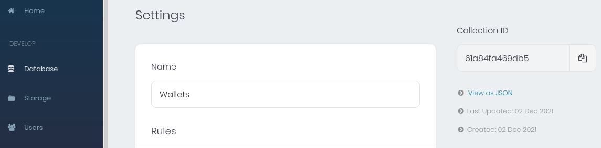

# Build Documentation

In order to run the project:

1. the appwrite docker swarm must be started
2. a project must be created in the Appwrite Console, with platform and API key needs
3. environment variables must be set with project-related data from Appwrite Console
4. an Admin teams and database collections should be initialized with provided python scripts
5. cloud functions must be added to the Appwrite project
6. the frontend must be build and started

On some Operating Systems like Ubuntu, you might need to write `sudo` before all the `docker` and "install"-related commands.

## 1. Starting Appwrite

If you don't have installed appwrite already in the project's root directory, you should do so first. You can use the single CLI command as described in `./frontend/README.md`.

Otherwise, when the `./appwrite/` folder is available together with `./appwrite/.env` and `./appwrite/docker-compose.yml`, you can start appwrite via one command within the `./appwrite/` folder:

```sh
docker-compose up -d
```

<details>
  <summary>*It doesn't work??*</summary>
  Maybe you have used the command together with the `-f` option which allows you to use a YAML configuratin from a different directory. If you do this it will use the environment variables of the directory where you executed the commmand and as there are maybe no `.env` variables in the current directory, it will not work.
</details>

It will not only start the Appwrite docker containers but also update running containers when `docker-compose.yml` or `.env` was changed.

## 2. Project Creation

This step can be skipped if this was done one time in the past.

You can check an online tutorial for how to setup a project:

[Create an Appwrite Project And Dashboard – Walkthrough](https://instacodeblog.com/create-an-appwrite-project-and-dashboard-walkthrough/)

## 3. Environment variables

*NFT-the-World* requires some environment variables. You can find a list of them in `./frontend/.env`. If missing, the frontend defines own default values set in `./frontend/utils/config.js`.

So before any scripts or the application can properly work, these environment variables must be set with values that you can obtain from the Appwrite console that was shown in step 2. Typical environment variables specifically used for our project start with `APPWRITE_...` or `REACT_APP_...`. Environment variables can be exported like so (replacing the `<project-ID>` with an actual string):

```sh
export APPWRITE_PROJECT=<project-ID>
```

### Appwrite Environment Variables (Before continuing)

There are some other environment variables in the `./appwrite/.env` file which are loaded when running Appwrite. Before you can add Admins to your team, you need to set the SMTP related environment variables there.

Example:
```
_APP_SMTP_HOST=mail.gmx.com
_APP_SMTP_PORT=587
_APP_SMTP_SECURE=TSL
_APP_SMTP_USERNAME=<your-email-address-which-permits-SMTP>
_APP_SMTP_PASSWORD=<your-plaintext-email-address-password;DONT-SHARE!>
```

## 4.1. Admin Team Creation

In order to use the privileged features in the frontend, an initial team of Admins must be added to the project. This process is faciliated by a Python script which is located in `./backend/python_init_script/main.py`.

The python script requires three things of input information. These can be passed as command line arguments. If one of this inputs is not specified, an environment variable is used by the Python script.

* Appwrite Endpoint URL, which is for example accessed by the frontend for API functionality. This typically is `<your-domain/IP>/v1/` **including the protocol specification** (e.g. `http://`).

  Environment variable: `APPWRITE_ENDPOINT`
  Command line prefix: `--endpoint=...`

* Appwrite Project ID. Copy the Project ID that is linked to the created project from step 2. You can copy the number from the URL while the project settings are opened. Example: `http://localhost/console/home?project=618eea46b90ef` -> the Project ID is the hexadecimal number behind `?project=`, i.e. `618eea46b90ef`.

  Environment variable: `APPWRITE_PROJECT_ID` (**NOT `APPWRITE_PROJECT`** which is used by other backend scripts instead)
  command line prefix: `--projectid=...`

* API key. This also needs to be taken from the Appwrite console. Choose an API-Key with enough permissions for the features that you'd want to use. For simplicity, it's recommended to use a master key with all permissions enabled but you only need `team` and `user` permissions. You can add an API key via the Appwrite console if not available. The "secret" of the key is the required value. It can be displayed when clicking on "Show Secret" under the API key's name in the Appwrite console. The secret will be a long string of hexadecimal digits like `d783e2aa495a03575...`.

  Environment variable: `APPWRITE_API_KEY`
  command line prefix: `--apikey=...`

  <details>
    <summary>My secret displays `false`??</summary>
    Then you should delete the key and generate it again.
  </details>

After you got the necessary project information, define the initial team of admins by editing `./backend/python_init_script/template.csv` (or the `.xlsx` excel file).  
Then start the script via following command from the root of the Git project, which does the remaining job for you. If you don't want to use the exported `$APPWRITE_...` environment variables, you can override environment variables with corresponding CLI arguments. You can omit command arguments when environment variables should be used.

```sh
python3 ./backend/python_init_script/main.py --endpoint=<...> --projectid=<...> --apikey=<...>  <path-to-CSV-or-XLSX-file>
```

or by passing shell variables to the script

```sh
APPWRITE_ENDPOINT="<...>" \
APPWRITE_PROJECT_ID="<...>" \
APPWRITE_API_KEY="<...>" \
python3 ./backend/python_init_script/main.py <path-to-CSV-or-XLSX-file>
```

<details>
  <summary>*What to do when there is a module import error?*</summary>
  Then you need to install some Python module dependencies first:
  ```sh
  pip3 install -r ./backend/python_init_script/requirements.txt
  ```
</details>

<details>
  <summary>*What file path to use?*</summary>
  The path to your file could be `./backend/python_init_script/template.csv` (or `.xlsx`) if you edited it for this purpose.
</details>

<details>
  <summary>*Output says SMTP is disabled?*</summary>
  It means you didn't set the SMTP environment variables `./appwrite/.env`. Then run `docker-compose` as described at the end of this step.
</details>

<details>
  <summary>*It displays "missing scope"!*</summary>
  If you see "missing scope" in the output it means, your API key didn't work – i.e. the API key doesn't exist, you're using a wrong value for `APPWRITE_API_KEY` or it   misses the said permissions as written in the script's output.
</details>

Don't forget to update your running instances of Appwrite containers after updating `./appwrite/.env` by executing this command in `./appwrite/`

```sh
docker-compose up -d
```

so that new environment variables take effect.

## 4.2. Initialization of database collections

There are python scripts which can be executed to initialize the database "collections" (a group of database documents with equal format) which allow the backend to create database documents and add them to that collection. Environment variables are needed again as input for the scripts. Execute following commands from the repository's route directory.

Before execution, environment variables `APPWRITE_ENDPOINT`, `APPWRITE_PROJECT` (**NOT `APPWRITE_PROJECT_ID`**) and `APPWRITE_API_KEY` need to be `export`ed (e.g. `export APPWRITE_PROJECT=618eea46b90ef`).

* initialize Wallet Collection:

  ```sh
  python3 ./backend/database-collection-schemas/createWalletsCollection.py
  ```
  
  After the Wallet Collection, you can copy the "Collection ID" value of the "Wallets" collection from the Appwrite Console.

  
  *(see upper right 'Collection ID')*  

  Add the Collection ID value to the environment variable `REACT_APP_WALLET_COLLECTION_ID` which will be needed for remembering the Wallet connection by the frontend code.

* initialize Announcement Collection:

  ```sh
  python3 ./backend/database-collection-schemas/createAnnouncementCollection.py
  ```
  
  Also add the Collection ID of this collection to `REACT_APP_ANNOUNCEMENT_COLLECTION_ID` in `./frontend/.env`.

You should add all environment variables starting with `REACT_APP_` (related to the frontend code) to `./frontend/.env`.  
Now there are only Function IDs missing in `./frontend/.env` which will be covered in the next step.

## 5. Add cloud functions

Each cloud function in the  `./backend/appwrite-functions/` directory (each represented by a subdirectory) needs to be installed in the Appwrite project.

Each cloud function directory contains a README.md which explains the deployment and how to use the function. In summary, deployment requires an archive, e.g. `.tar.gz`, containing the executed script (`main.py`) and all required additional dependency modules that must be installed into a proper subdirectory via `pip`.

<details>
  <summary>*How to install dependency modules into my directory with PIP?*</summary>
  For example the `appwrite` dependency can be installed into subdirectory `./.appwrite/` by executing this comment in the root of the repository.

  ```sh
  pushd ./backend/appwrite-functions/<cloud-function-path>/
  PIP_TARGET=./.appwrite pip install -r ./requirements.txt --upgrade --ignore-installed
  popd
  ```

  `<cloud-function-path>` is replaced with the path that leads to the `main.py` file of the corresponding cloud function's directory.

  This command requires that `requirements.txt` and `main.py` are located in the same directory.
</details>

The archive then is uploaded as "Function" to the appwrite console. In the project page of the Appwrite Console, the `Functions` area can be opened by clicking on the `Functions` tab in the left ribbon. Choose `python...` as runtime and any name you like. Then upload the archive there.

<details>
  <summary>*Annoying. Isn't there an automatic way to do this?*</summary>
  This manual process can also be automatized via the `appwrite CLI` but which is totally optional to install and use.

  ```sh
  export APPWRITE_FUNCTION_ID=<13-digit-hexadecimal-string>
  appwrite functions createTag --functionId=$APPWRITE_FUNCTION_ID --command=<script-run-command> --code=<script-path-in-archive>
  ```

  `APPWRITE_FUNCTION_ID` is an environment variable which is used as fallback value for the `functionId` of the `appwrite functions createTag` command.
  
  You also can use other supported programming languages instead of the typical Shell but the "Appwrite CLI" API most likely will work out of the box.
</details>

<details>
  <summary>*How to set the input for cloud function execution?*</summary>
  After the upload is finished, the "Function ID" on the right side of the "Functions" page later can be copied and saved in environment variable `APPWRITE_FUNCTION_ID` when executing it. Other required environment variables for execution can be `APPWRITE_FUNCTION_PROJECT_ID` (yet another environment variable for the Appwrite Project ID), `APPWRITE_FUNCTION_USER_ID` (which can be retrieved from the "Users" page of the Appwrite Console for the desired user) and `APPWRITE_FUNCTION_DATA` (which contains input for the function).
</details>

## 6 Building and running the frontend

After the environment variables are set in `./frontend/.env`, Admins teams and database collections were initialized, the frontend can be build in the last step. In the root of the git project, you can use following for building

```sh
docker build -t <name> ./frontend/
```

and running

```
docker run -it -p <port>:80 <name>
```

the application. `<name>` could be for example `nftfrontend` and `<port>` could be `8181` which means that the application would be available at the URL `${APPWRITE_DOMAIN}:8181` which could be `localhost:8181` for example.

## Done

Now you can access *NFT-the-World* at the `<port>` to which you bound the frontend's docker container.

# User Documentation

Following can be used in the app:

## sign up

One can create a new account on the signup page. Enter a username, email and password, and create a new account.


### email verification

After creating an account a email will be sent to the email specified at sign up which can be verified by clicking on the link in the received email.

The email (in German) will look something like this:


## Log In

One can log in their account by accessing the login page where they need to enter their email and password.


## FAQ page

On the FAQ page users can get answers to frequently asked questions.


## User Profile

In the profile users can see basic information regarding their profile.


### Password Change

One can change their password through the profile. On the password change page one needs to enter their old and a new password and confirm that they want to change their password. 


### Connect Crypto Wallet with account

One can connect your ETH wallet by accessing the profile. Currently, only MetaMask is supported. To this end, one needs to click on the connect wallet button and confirm that they want to connect their wallet in MetaMask.


## Creation and Modification of Announcements [WIP]

As an admin, announcements can be created. All other users can view announcements e.g. on the landing page. For admins, extra buttons are displayed where they can reach a webpage for editing announcements.

Admin view:


User view:


# Technical documentation

For more details, there are `README.md` files within some directories like `./frontend/` and `./blockchain/`.

There is also a wiki page which explains the repository structure.

# Software architecture description

Please have a look in the Wiki for an overview over the repository artifacts.
