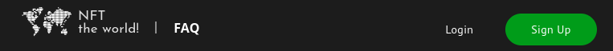

# User Documentation

## Capability Summary

Our web application has these capabilities:

* create and schedule NFT drops
* reservation and minting of NFTs after it dropped
* allow users to buy and view NFTs in their own collection
* direct interaction with the blockchain, retrieving and displaying up-to-date NFT-Drop and Blockchain ABI information
* minted NFTs usable even without the webservice
* announcement creation, editing and deletion
* User management (signup, login/logout, password change, password reset, add to verified partners team, add to admins team)
* Wallet connection

## Unregistered User

An unregistered user has the least abilities and can take a look at NFT-Drops and at the announcements but has no profile.

At the moment, potentially everyone is able to connect their wallet to the application and reserve a buying position on an NFT Drop, even unregistered users.

### sign up

One can create a new account on the signup page. Enter a username, email and password, and create a new account.

The email address is minimally checked for a certain syntactic format. It must be unique and cannot be shared by multiple accounts.

The code in this project won't use your email address for any unsolicited purposes or marketing except for security purposes which are explicitly initiated by users.

The password must at least contain 6 characters. There is no second password check field. It doesn't help so much if you just could copy and paste your password in both password fields.

It will help you with a hint, it something didn't work. Same for the login page.

This image shows an example for an invalid login password.

#### email confirmation

After creating an account, an email is automatically sent to the email address specified at sign up. The address is verified by clicking on the link in the received email.

The email (in German) will look something like this:

### Log In

They can log in their account by accessing the login page. The application header features a login-button in the top right (second from left).

On the login page, they need to enter their email and password.

The lower-right corner will redirect you to the signup page in case you notice that you don't actually have an account ;-) .

#### Reset Password

If you think, you forgot your password, you can send a password-reset-request to an email address that is linked to the account. To access this page, click on `Forget password?` in the lower-left corner of the login page.

The email contains a link which allows a one-time password recovery. (German in our case.)

While you can use as many different password reset links as you like until they expire after a finite time, each link can reset the password only once.

### NFT Drops

NFT Drops are collections of random NFTs which have a countdown. During the countdown you can reserve a "buying position" that you can use after the countdown to buy them. The reservation has no binding character but is required for being able to buy them later. Buyers receive a random NFT from that collection that they potentially can sell to others or use for whatever legal purpose.

**Be aware that buying NFTs will not automatically transfer you legal or owner rights of any real or metaverse space or estate! As of 2022, the meaning of NFTs underlies community conventions and software application-logic and transfers no legal rights.**

Users can view the NFTs of an NFT Drop by clicking on an entry in the NFT Drop container on the landing page.

This leads to the NFT Drop page. An example NFT Drop (for Nürnburg NFTs) looks like this:

We also designed an individual NFT page with specific information which you can see in the `/assets/README.md` but we didn't implement it because other things were more important.

If you didn't connect your wallet so far, you have the ability to do now when you want to buy some.

You can only reserve up to 5% of the total number of NFTs. Not a bug, it's a feature.

#### Buying NFTs

**CAUTION! Despite anyone being offered to buy NFTs of stale NFT Drops, not having registered a buying position during the countdown will make the transaction fail and waste your money!!**

**Also don't waste time until buying them because Drop creators can set an arbitrary time limit how long your buying position remains valid after the countdown reached zero!**

Select the number of NFTs that you have reserved to buy earlier.

When clicking on `Buy NFTs!` on a stale NFT Drop, MetaMask will open where you can confirm the transaction. If you are sure, you have a valid buying position and entered a valid number of NFTs to buy, _skip the red warning about the transaction being expected to fail_.

Before going ahead you probably want to adapt your gas fees for the transaction. Click on the blue `edit` link that appeared after dismissing the warning. Then you'll see this intermediate gas preview:

Ignore the yellow warning on the gas preview screen. The default gas estimation is quite over-exaggerated. Adapt your gas fees in MetaMask:

There are mainly two (but three) options.

- gas limit:
  The gas amount estimates how much effort (work) is needed to execute and verify the transaction. For buying NFTs from us, $40 000$ is a good upper estimation for the transaction. The more NFTs you buy, the more work might be required to execute the Smart Contract. If you buy a huge amount of NFTs, say $10 000$ this would require more gas than just a fee for $100$ and you should maybe estimate with a higher gas limit than $40000$.

  You should not be too stingy here. If you estimate too low, the transaction will fail and you wasted your money. But if you estimate too much, you will only pay the amount of gas that was actually used.

- priority fee:
  This is like a "salary" for the blockchain workers ("miners") to verify your transaction which you are ready to pay. This loan is paid per single gas unit of work.

  Of course, more miserly payment gives workers fewer incentive, particularly if you want to burden them with a higher gas limit, and they will let your transaction wait longer until they pick it up, if they will at all.

  A value of $2.5$ has been shown to provide very good incentives and will finish your transaction within 10 seconds.

- max fee
  This is the upper limit for priority fee + base fee that you are willing to pay AT MOST for each unit of gas. It caps the amount of work in a second way. The base fee are fixed costs which are negligable (at least for the Kovan testnet).

When your account can cover the chosen gas fees and you are fine, you can save it.

Then confirm the transaction or reject it.

### View Announcements

Announcements are displayed on the landing page and the FAQ page.

They can click on the announcement to be redirected to the dedicated announcement page.

### FAQ page

On the FAQ page users can get answers to frequently asked questions. A link is available right to the project logo very left in the application header.

The FAQ page lists some important questions for newbies. By clicking on a question, it will expand an answer underneath and the question is emphased in green color. The answer can be collapsed back to normal by reclicking an expanded question.

The `all` button will collapse all questions if and only if all questions are expanded. Otherwise it will expand all.

The `multi-mode` button toggles the expansion mode. By default, only one question is expanded at a time. With `multi-mode`, you can expand multiple.
## Regular Users

If you sign up with a new account, you will be a regular user. There is also an email confirmation mechanism which is unfortunately not required at the moment to use your account.

A regular user can do a subset of what Partners or Admins can do. In addition to unregistered users, they can view their NFT collection and can be promoted to become partners or Admins.

In potential future development, additional features for registered users and limitations for unregistered users are possible. One vision was to incorporate a communication platform for NFT enthusiasts around certain suppliers (or artists) to offer an all-in-one solution without multiple accounts.

### User Profile

In the profile users can see basic information regarding their profile.

The profile picture doesn't work?!

At the point of writing, the profile image uses a static image and cannot be changed. There is a PR (announcement images) which contains a reusable EditableImage Component for (untested) uploading, updating and showing the image.

At the bottom of the page, you can end the user session with the read `logout` button.

There is currently no simple GUI way implemented to delete user accounts.

#### Re-request email confirmation

This feature exists because email confirmation is not necessary yet for using the account. Improved user management should remove this feature later.

An email confirmation can be re-requested by clicking on the "resent email verification" link at top of the profile page. It is not display if you are already verified. Then you will see a green checkmark in the password section.

#### Profile's NFT Collection

You can access your collection either by click on the `My Collection` on the right side of the application header (when logged in)

or by clicking on the button `NFT Collection` under the image in your profile (see profile image above).

If you didn't connect your wallet to the application recently, then you need to click on the blue `Connect MetaMask Wallet` button under the profile's statistics.

If it can load your NFTs successfully, it will show an NFT-card container like the one used on the NFT Drop page.

#### Password Change

They can change their password within the profile page.

In the `Change Password` section, enter your old and a new password. Repeat your new password for confirmation. Click on `save new password` below the text fields to activate the change.

If it doesn't work, it will give you helpful error messages what didn't work.

The image shows an example where the user didn't provide the correct old password.

#### Connect Crypto Wallet with account

They can connect their ETH wallet by accessing the profile. Currently, only MetaMask is supported. To this end, you need to click on the connect wallet button

and confirm that you want to connect your wallet in MetaMask.

You can always trust us.

## Partner Features

Only partners are able to successfully create NFT Drops. For this ability, they need to be registered at the blockchain but unlike Admins they might not have the same adminstrative power.

### NFT Drop Creation

On their profile page, they have an additional button which allows them to access the drop creation page.

The Drop Creation Page is tailored to make the whole process fairly easy for non-technical users to create one with just clicks and copy-pasting of URLs.

There are mainly the NFT (Drop) name + price, a countdown, and a valid buying timespan (after the drop countdown) to set and of course the NFT images.

If you are done, click on `` to arrive at the confirmation where you check all your details for correctness.

You can go back to the editing form by clicking on the rather hidden white cross in the upper right corner.

If you are fine with the displayed settings, click on the blue `connect Wallet` button on the left and afterwards on the green `blockchain` button which opens up MetaMask to confirm the actual transaction which will create the NFT Drop.

Any change to the blockchain like the NFT Drop creation is a transaction for which you need to pay gas fees.

**You can estimate with a gas limit of $50000$.**

## Admin Features

Regular Admins (which aren't also verified Partners) cannot create drops but can manage users and, most important, create announcements ;-) .

### Admin Area 51

They can access a transcendental area by clicking the Admin button on the right side of the Admin's application header.

Users, that try to access that URL without Admin rights won't see anything, mysterious!

This is not just made up, here it is:

The Admin Area allows for inviting or removing users from certain teams. Only Admins with partners status can fiddle around with the blockchain.

### General

#### Creation, deletion and modification of Announcements

As an admin, announcements can be created. Announcements are news messages which can be used to notify visitors of the site about upcomming or interesting changes. All other users can view announcements, e.g. on the landing page. For admins, extra buttons are displayed.

Clicking "Delete" will instantly kill the announcement without a question. "Edit" will lead you to the regular announcement page which however is enhanced with extra functionality for Admins where announcements can be edited.

You can reach this page either by clicking on a link in the announcement sidebar when it is embedded into a page or by using the `create and edit announcements` button which you can see in the above image of the Admin area.

You can either create a very new announcement by filling out the text fields in the announcement editor at the top of the page or you can edit existing announcements to update or delete them.

### Backend - Team Database Management

This section contains database operations in regards to the user teams.

#### Inviting and editing Admins Team

Admins can change Admin team associations by entering the email address of a person for which an operation should be applied. Then click on `SEARCH USER` button emphasized in blue.

It will search for the email address in the database and based on the result, it will suggest you to add the email address when not found, or remove the email address when found. The email addresss acts as represent for the account that is associated with it.

Before you can apply the operation, you first need to check the checkbox for confirmation to prevent accidentally clicking on the button.

With an invitation, it will send an email to the provided email address, notifying them about their invitation which they can accept.

You can also remove Admins, including yourself!

Let this be a lesson and don't invite people as Admins that could want to grab for power and kick you from your Admin status!

#### Inviting and editing Partners Team

As a verified Partner and Admin, you can invite new partners. There is no more powerful creature out there in "NFT The World" :-) .

Admins without Partner status cannot add new Partners to the database or remove existing ones.

Otherwise, as a partner, you can add new partners in the same way how new Admins can be added.

### Contract - Smart Contract interaction

In this section, special blockchain transactions can be initiated which append live blockchain data. For security, the partners association is saved directly on the blockchain.

#### Creating an NFT Drop

Basically just a convenient shortcut for the additional profile button which can be used by Partners with Admin status. Read more about NFT Drop creation in the Partners Capabilities section.

#### Adding Partners/Admins

Well, actually every Admin can add Partners and thus themselves as well.

Select which team should be modified and below the operation to apply to a (potential) team member.

Then enter the hexadecimal address of the wallet that should obtain Partner status. A registered user logged in with that wallet will be entitled to the capabilities of verified partners!

Click on the emphasized blue button saying `ADD USER TO CONTRACT PARTNER TEAM` to conduct the operation. Keep in mind that this is a blockchain transaction and requires paying a gas fee. MetaMask will open and prompt you for confirmation.

You can estimate the gas limit with $30000$.

